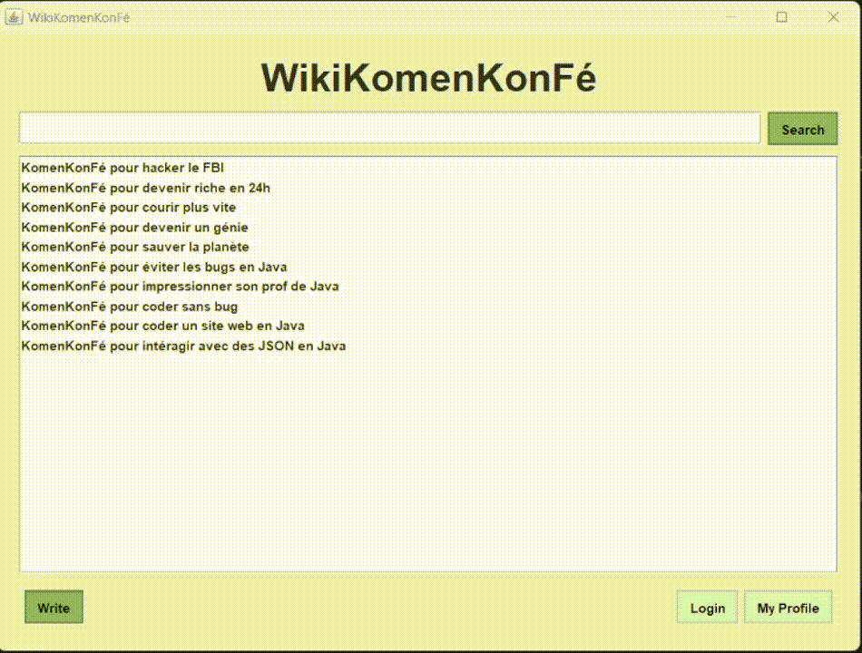

<p align="center">
  
</p>

---

## 📚 About the project

The goal of this projet was to create a simple Java GUI application that will implement the concept of heritance and polymorphism.

The application is a simple wiki that will allow the user to create, read, update and delete articles.

The final project can be tested by cloning the repository and open it in an IDE (IntelliJ was used for create the project) :
```bash
git clone https://github.com/LucasAstley/WikiKomenKonFe.git
```

---

## 🎥 Demo


